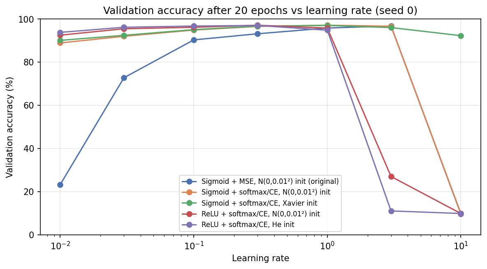
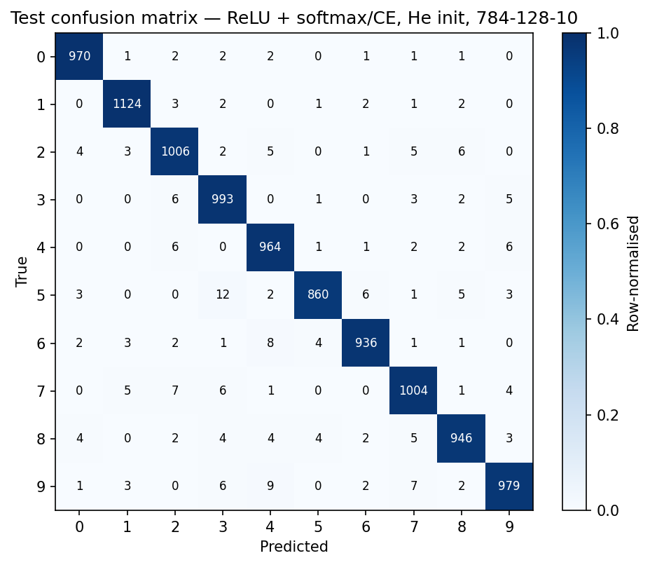
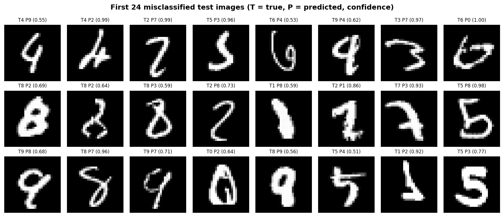
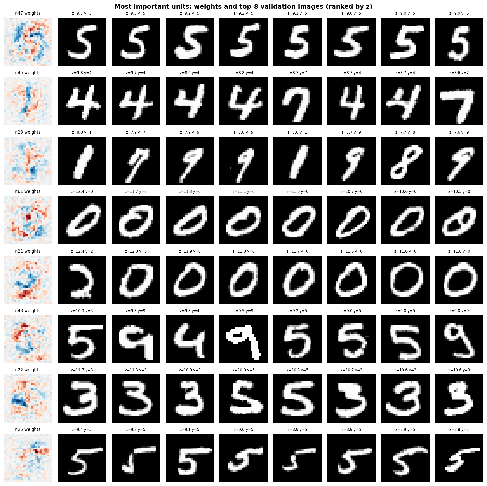

# Neural Network from Scratch in NumPy

This repository contains a multilayer perceptron for MNIST classification built with Python and NumPy. The forward pass, backpropagation, parameter updates, activation functions, and loss functions are implemented manually rather than through a deep-learning framework.

The project also includes numerical gradient checking, architecture comparisons, ablation experiments, error analysis, and hidden-unit visualization.

## Key results

| Item | Result |
|---|---|
| Final model | 784-128-10, ReLU + softmax/cross-entropy, He initialization, mini-batch SGD |
| Test accuracy | **97.88 ± 0.07%** over 3 seeds on the full 10,000-image MNIST test set |
| Macro F1 | **97.81%** for seed 0 |
| Gradient check | Maximum relative error ≤ **2.6 × 10⁻⁷** |
| Sigmoid + MSE reference run | **96.70 ± 0.16%** validation accuracy |

The main implementation is in `src/`. Scikit-learn is used only in an optional comparison script.

---

## Model

For a mini-batch $(X \in \mathbb{R}^{N \times 784}\)$, the network uses one hidden layer:

$$
Z_1 = XW_1+b_1,\qquad A_1=\phi(Z_1),\qquad Z_2=A_1W_2+b_2,\qquad P=\mathrm{softmax}(Z_2)
$$

where $(\phi\)$ can be ReLU or sigmoid.

For the softmax/cross-entropy version, the loss is

$$
\mathcal{L} = -\frac{1}{N}\sum_{n=1}^{N}\sum_{k=1}^{10}Y_{nk}\log(P_{nk})
$$

and the output-layer gradient is

$$
\delta_2 = \frac{1}{N}(P-Y)
$$

followed by

$$
\frac{\partial \mathcal{L}}{\partial W_2}=A_1^\top\delta_2,\qquad \frac{\partial \mathcal{L}}{\partial b_2}=\sum_n\delta_{2,n}
$$

and

$$
\delta_1=(\delta_2W_2^\top)\odot\phi'(Z_1)
$$

$$
\frac{\partial \mathcal{L}}{\partial W_1}=X^\top\delta_1,\qquad \frac{\partial \mathcal{L}}{\partial b_1}=\sum_n\delta_{1,n}
$$

All parameter updates are performed explicitly with mini-batch gradient descent.

The implementation also supports sigmoid output with MSE loss so the effects of different activation and loss choices can be compared.

### Initialization

The implementation supports:

- small Gaussian initialization: $\mathcal{N}(0,0.01^2)$
- Xavier initialization
- He initialization

### Gradient checking

The analytical gradients are compared with central finite differences on small float64 networks:

$$
\frac{\mathcal{L}(\theta+\epsilon)-\mathcal{L}(\theta-\epsilon)}{2\epsilon}
$$

with $\epsilon=10^{-5}$.

Across the tested combinations of activation, loss, initialization, and network depth, the maximum relative error was between $3.2\times10^{-8}$ and $2.6\times10^{-7}$.

See [`results/tables/gradient_check.md`](results/tables/gradient_check.md).

---

## Experimental setup

- **Dataset:** MNIST
- **Training split:** 50,000 images
- **Validation split:** 10,000 images
- **Test set:** official 10,000-image MNIST test set
- **Batch size:** 64 for the main experiments
- **Training:** 20 epochs
- **Optimizer:** plain SGD
- **Seeds:** 0, 1, and 2

The official training set is split once using a fixed seed. Model and learning-rate selection are done using the validation set. The test set is kept untouched until the final evaluation stage, after model selection is complete.

For each configuration, the learning rate is selected from:

`0.01, 0.03, 0.1, 0.3, 1, 3, 10`

using validation accuracy with seed 0. The selected setting is then trained with three seeds and reported as mean ± standard deviation.

---

## Results

### 1. Sigmoid + MSE reference configuration

A 784-64-10 network with sigmoid activations, MSE loss, small Gaussian initialization, batch size 1, learning rate 0.1, and 10 epochs is used as a reference configuration.

**Validation accuracy: 96.70 ± 0.16%**

Per-seed validation accuracies:

- 96.88%
- 96.66%
- 96.56%

### 2. Ablation study

The ablation study uses a fixed 784-64-10 architecture, batch size 64, and 20 epochs.

| Configuration | Best LR | Val acc after epoch 1 (%) | Final train acc (%) | Final val acc (%) | Δ val vs baseline (pp) |
|---|---:|---:|---:|---:|---:|
| Sigmoid + MSE, N(0,0.01²) init | 3.0 | 90.76 | 98.50 ± 0.06 | 96.73 ± 0.05 | +0.00 |
| Sigmoid + softmax/CE, N(0,0.01²) init | 1.0 | 92.60 | 99.78 ± 0.02 | 97.09 ± 0.04 | +0.36 |
| Sigmoid + softmax/CE, Xavier init | 1.0 | 92.84 | 99.81 ± 0.02 | 97.08 ± 0.10 | +0.35 |
| ReLU + softmax/CE, N(0,0.01²) init | 0.3 | 93.15 | 99.83 ± 0.03 | 97.15 ± 0.12 | +0.43 |
| ReLU + softmax/CE, He init | 0.3 | 93.65 | 99.91 ± 0.02 | 97.11 ± 0.13 | +0.39 |

<p align="center">

</p>

Replacing sigmoid+MSE with softmax/cross-entropy produced the largest isolated gain in mean validation accuracy in this experiment.

With a tuned learning rate, the final validation accuracies of the softmax/cross-entropy configurations are close to one another. ReLU and He initialization mainly improve early training and make the model less sensitive to the learning rate.

For example, at learning rate 0.1, the sigmoid+MSE configuration reaches 90.32% validation accuracy, while ReLU+He reaches 96.74%. At learning rate 0.01, the same configurations reach 23.26% and 93.80%, respectively.

### 3. Hidden-layer size

Two model families were compared with 16, 64, and 128 hidden units.

| Formulation | Hidden | Params | LR | Train acc (%) | Val acc (%) | Train-val gap (pp) |
|---|---:|---:|---:|---:|---:|---:|
| Sigmoid + MSE | 16 | 12,730 | 3.0 | 95.48 ± 0.32 | 93.57 ± 0.46 | 1.91 |
| Sigmoid + MSE | 64 | 50,890 | 3.0 | 98.50 ± 0.06 | 96.73 ± 0.05 | 1.77 |
| Sigmoid + MSE | 128 | 101,770 | 3.0 | 98.68 ± 0.05 | 96.95 ± 0.14 | 1.73 |
| ReLU + softmax/CE | 16 | 12,730 | 0.3 | 95.88 ± 1.12 | 93.80 ± 1.08 | 2.08 |
| ReLU + softmax/CE | 64 | 50,890 | 0.3 | 99.91 ± 0.02 | 97.11 ± 0.13 | 2.80 |
| ReLU + softmax/CE | **128** | 101,770 | 0.3 | 99.99 ± 0.00 | **97.66 ± 0.01** | 2.33 |

The 16-unit models underfit compared with the larger models. Validation accuracy improves from 64 to 128 units in both model families.

For the ReLU/CE models, validation loss starts to rise slightly late in training even though validation accuracy stays almost flat. This suggests mild overfitting and increasingly confident predictions.

The ReLU + softmax/CE + He model with 128 hidden units had the highest mean validation accuracy among the architecture-comparison candidates and was selected for final test evaluation.

### 4. Final test evaluation

The selected 784-128-10 model was evaluated on the full MNIST test set using three seeds.

**Test accuracy: 97.88 ± 0.07%**

Per-seed test accuracies:

- 97.82%
- 97.96%
- 97.85%

For seed 0:

- 218 misclassified images out of 10,000
- macro F1: **97.81%**
- per-class F1: **97.39% to 98.86%**
- lowest recall: digit 5 at **96.41%**

The most frequent errors were:

- 5 → 3: 12 cases
- 9 → 4: 9 cases
- 6 → 4: 8 cases

<p align="center">


</p>

Full per-class results are available in [`results/tables/per_class_test.md`](results/tables/per_class_test.md).

### 5. Hidden-unit analysis

A 784-64-10 ReLU/CE model is used for the hidden-unit analysis so the learned representations remain easy to inspect.

<p align="center">

</p>

The analysis includes:

- input-weight maps for all hidden units
- top-activating validation samples ranked by pre-activation \(z\)
- single-unit ablation
- class-selectivity analysis
- comparison between weight variance and ablation-based importance

The weight maps show that many hidden units respond to combinations of positive and negative input-weight regions rather than acting as simple digit templates.

Several units respond to stroke patterns shared across multiple digits, while others are more class-specific.

Removing one hidden unit at a time causes a maximum validation-accuracy drop of 1.01 percentage points, with a median drop of 0.24 points. This suggests that the representation is distributed across many units.

The rank correlation between input-weight variance and ablation importance is:

- Spearman $\rho = 0.71$ for the ReLU model
- Spearman $\rho = 0.41$ for the sigmoid+MSE reference model

Additional figures:

- [All hidden-unit weight maps](results/figures/weight_maps_all.png)
- [Class selectivity](results/figures/class_selectivity.png)
- [Weight variance vs. ablation importance](results/figures/variance_vs_importance.png)

### Optional scikit-learn comparison

As a secondary comparison, `experiments/sklearn_baseline.py` trains an `MLPClassifier` with a comparable architecture and training setup.

- scikit-learn validation accuracy: **97.62 ± 0.11%**
- NumPy implementation: **97.66 ± 0.01%**

The scikit-learn model is not used in the main implementation.

---

## Repository structure

```text
neural-network-from-scratch/
├── README.md
├── requirements.txt
├── requirements-optional.txt
├── run_all.sh
├── pytest.ini
├── .gitignore
│
├── src/
│   ├── data.py
│   ├── layers.py
│   ├── losses.py
│   ├── model.py
│   ├── training.py
│   ├── gradcheck.py
│   ├── metrics.py
│   ├── analysis.py
│   ├── visualize.py
│   └── utils.py
│
├── experiments/
│   ├── ablation.py
│   ├── architecture_comparison.py
│   ├── common.py
│   ├── feature_analysis.py
│   ├── final_evaluation.py
│   ├── gradient_check.py
│   ├── sigmoid_mse_baseline.py
│   └── sklearn_baseline.py
│
├── notebooks/
│   └── demo.ipynb
│
├── tests/
│   ├── test_data_split.py
│   ├── test_gradcheck.py
│   ├── test_losses.py
│   ├── test_shapes.py
│   └── test_softmax.py
│
└── results/
    ├── figures/
    ├── logs/
    ├── models/
    ├── tables/
    └── selected_config.json
```

---

## Running the project

```bash
git clone https://github.com/yeganeh-aghajani/neural-network-from-scratch.git
cd neural-network-from-scratch

python -m venv .venv
source .venv/bin/activate
# Windows:
# .venv\Scripts\activate

pip install -r requirements.txt
```

Run the tests:

```bash
python -m pytest -q
```

Run individual experiments:

```bash
python -m experiments.gradient_check
python -m experiments.sigmoid_mse_baseline
python -m experiments.ablation
python -m experiments.architecture_comparison
python -m experiments.final_evaluation
python -m experiments.feature_analysis
```

Or run the full pipeline:

```bash
bash run_all.sh
```

Optional dependencies:

```bash
pip install -r requirements-optional.txt
python -m experiments.sklearn_baseline
jupyter notebook notebooks/demo.ipynb
```

MNIST is downloaded automatically to `data/` the first time it is needed.

Most experiment scripts also support `--quick` for a short smoke test.

---

## Limitations

- The model is a single-hidden-layer MLP, so the goal is not state-of-the-art MNIST performance.
- Training uses plain SGD without regularization.
- Validation loss shows mild late-training overfitting in the larger ReLU models.
- Learning-rate selection uses a coarse grid and a single seed before the final multi-seed runs.
